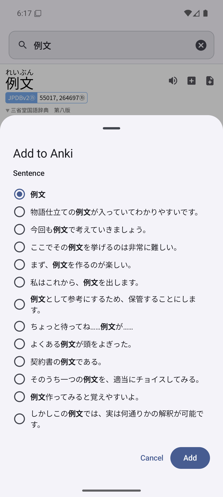

## About this fork

This is a personal fork of [Hoshi Reader Android](https://github.com/HuangAntimony/Hoshi-Reader-Android) that tracks upstream closely while adding a few mining-focused extras.

The main addition is a separate card-creation button that lets you pick a [Massif](https://massif.la) example sentence when adding an Anki card.

  

# Hoshi Reader Android

**English** | [简体中文](README.zh-CN.md)

Hoshi Reader Android is a lightweight Japanese EPUB reader app for Android, built for immersion learning with Yomitan lookup, Anki card creation, audiobook read-along, and e-ink mode options.

This project is a native Android recreation of [Hoshi Reader](https://github.com/Manhhao/Hoshi-Reader).

<table>
  <tr>
    <td></td>
    <td></td>
    <td></td>
    <td></td>
  </tr>
  <tr>
    <td></td>
    <td></td>
    <td></td>
    <td></td>
  </tr>
  <tr>
    <td></td>
    <td></td>
    <td></td>
    <td></td>
  </tr>
</table>

## Features

### Bookshelf

- Import EPUBs individually, in batches, or recursively from folders, and keep reading progress visible from the bookshelf.
- Organize books with custom shelves.
- Export EPUBs or pull remote synced books back into the local library.

### Reading

- Read Japanese books in vertical or horizontal text, with paginated or continuous scrolling.
- Customize themes, fonts, paragraph spacing, and reader controls, including custom reader themes.
- Use immersive focus mode, volume-key page turning, and e-ink display options.
- Open reader images in fullscreen with zoom, copy, save, and share actions.

### Lookup

- Import, download, update, and manage Yomitan dictionaries.
- Tap text in the reader, search from the Dictionary tab, or look up selected text from other Android apps.
- Tap unknown words inside definitions for recursive lookup.
- Inject custom CSS styles.
- Use online or local word audio.

### Highlights And Statistics

- Add five-color highlights while reading and jump to them at any time.
- Track reading statistics, including characters read, time spent, and reading speed, with live display while reading.

### Anki Card Mining

- Create cards through AnkiDroid or AnkiConnect.
- Use [Lapis](https://github.com/donkuri/lapis)-compatible fields, duplicate checks, and media export.

### Audiobook Read-Along

- Match audiobook subtitle files to book text to highlight the current sentence.
- Follow highlights with automatic page turning.
- Control playback speed, skip actions, and Android media controls.

### Data Sync And Migration

- Sync reading progress, statistics, and books through Google Drive, compatible with ッツ Reader.
- Import or export ッツ bookdata, and back up or restore books and dictionaries with `.hoshi` archives compatible with Hoshi Reader iOS.

## Why Migrate From Yomitan + ッツ Reader

- **One app instead of a stitched setup:** EPUB reading, Yomitan lookup, Anki mining, local audio, and audiobook read-along all live inside Hoshi.
- **Faster import and lookup speed:** native C++ hoshidicts makes dictionary import roughly 100x faster, supports batch importing Yomitan dictionaries, and heavily optimizes lookup speed, especially on low-end and e-ink devices.
- **Better Android reading experience:** custom reader themes, e-ink display tuning, low-end-device performance, and volume-key paging are treated as first-class reader features.
- **Annotations and bookshelf control:** sentence highlights and bookmarks make it easy to save passages you want to revisit, while custom bookshelves and recursive folder import keep local libraries organized.
- **Smoother popups and local audio:** dictionary popups can be dismissed with a swipe, and local word audio can be used directly in reading and card creation without configuring AnkiConnect Android.
- **Direct AnkiDroid card mining:** Hoshi can create cards through AnkiDroid without AnkiConnect Android, keeping the common Android mining path simpler.
- **Better audiobook workflow:** Hoshi streamlines audiobook setup and provides better audiobook audio progress and playback controls; when creating cards, it can also expand captured audio to the full sentence instead of making you stitch subtitle lines manually.
- **Sync and migration path:** Google Drive sync covers progress, statistics, and books with ッツ compatibility, plus `.hoshi` iOS backup restore and ッツ bookdata import/export.

## Why Choose Hoshi Over jidoujisho For EPUB Reading

- **Reading-focused design:** Hoshi keeps Japanese EPUB reading, lookup, and card mining in one focused flow; jidoujisho's video, manga, web, and cross-media tooling can feel heavy for reading-only workflows.
- **Reliable support for core Yomitan dictionaries:** Hoshi supports term, frequency, and pitch dictionaries; jidoujisho is unreliable with structured glossary content and dictionary media rendering.
- **Dedicated C++ dictionary engine:** native hoshidicts keeps imports fast, lookups responsive, and dictionary storage compact, with Low Memory Usage Mode for low-memory devices.
- **Recursive lookup inside definitions:** tap unknown words directly inside dictionary definitions to open nested lookups without copying text, starting a new search, or leaving the current context.
- **Maintained EPUB reader:** Hoshi ships a customizable EPUB reader with annotations and reading statistics in the core flow; jidoujisho bundles an older ッツ Reader build that can fail to import or open real-world EPUBs.
- **E-ink device support:** high-contrast UI, dedicated popup definition CSS, and underline-style lookup and audiobook highlights improve e-ink readability, with solid support for low-end devices.
- **EPUB audiobook read-along:** Hoshi aligns audiobook subtitles with the book text for sentence highlighting, auto page turning, playback control, and sentence-audio mining; jidoujisho does not provide an equivalent book-aligned audiobook workflow for EPUB reading.
- **Multi-device sync and migration:** Google Drive sync is compatible with ッツ Reader, and Hoshi supports cross-device import, export, and backup restore; jidoujisho does not provide an equivalent sync or backup migration path.

## Download Hoshi Reader Android APK

Download the latest Hoshi Reader Android APK from [GitHub Releases](https://github.com/HuangAntimony/Hoshi-Reader-Android/releases/latest).

Hoshi Reader Android requires Android 8.0 or later.

## Development Status

Feature parity with the iOS app is complete. Current development focuses on polishing UI and user interactions.

See [docs/CHANGELOG.md](docs/CHANGELOG.md) for shipped user-visible changes.

## Feature Requests

Please submit general feature requests to the iOS repository first.

If the request is Android-specific, or cannot be implemented on iOS because of system limitations, such as e-ink themes or volume-key page turning, please open an issue in this repository.

## Privacy And Data

Hoshi Reader Android stores imported books, dictionaries, fonts, audiobook data, reading progress, highlights, statistics, and settings locally in app storage.

Google Drive sync uses a user-configured Google Cloud OAuth device-code flow. Anki card mining talks to AnkiDroid or the configured AnkiConnect endpoint. Update checks read GitHub release metadata.

## Attribution

Hoshi Reader Android builds on this ecosystem:

- [Hoshi Reader iOS](https://github.com/Manhhao/Hoshi-Reader) as the reference implementation.
- [hoshidicts](https://github.com/Manhhao/hoshidicts) and [hoshidicts-kotlin-bridge](https://github.com/Manhhao/hoshidicts-kotlin-bridge) for Yomitan dictionary support.
- [Yomitan](https://github.com/yomidevs/yomitan) for dictionary format and lookup inspiration.
- [AnkiDroid](https://github.com/ankidroid/Anki-Android) for Android card creation integration.
- [Ankiconnect Android](https://github.com/KamWithK/AnkiconnectAndroid) for local audio behavior and AnkiDroid duplicate scope/checksum query references.
- [ッツ Ebook Reader](https://github.com/ttu-ttu/ebook-reader) for reader, statistics, and sync compatibility references.

## License

Distributed under the GNU General Public License v3.0. See [LICENSE](LICENSE) for details.

## Star History

If Hoshi Reader Android helps your reading workflow, please consider giving the project a star.

  <picture>
    <source media="(prefers-color-scheme: dark)" srcset="https://api.star-history.com/chart?repos=HuangAntimony/Hoshi-Reader-Android&type=date&theme=dark&legend=top-left" />
    <source media="(prefers-color-scheme: light)" srcset="https://api.star-history.com/chart?repos=HuangAntimony/Hoshi-Reader-Android&type=date&legend=top-left" />
    
  </picture>

